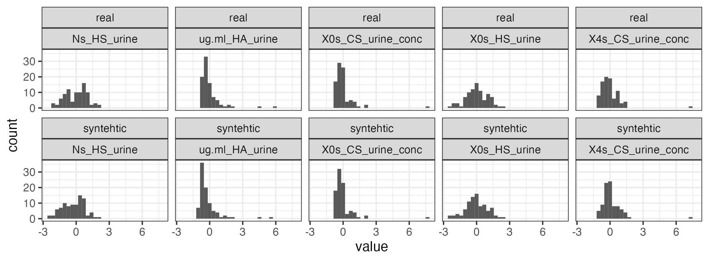

# Introduction

This report accompanies the article *Urine Free Glycosaminoglycans to Identify Adults at High Risk of Developing Early-Stage High-Grade Bladder Cancer* by Gatto et al 2024.

It demonstrates the use of projection predictive feature selection to create a model for predicting the probability of bladder cancer based on free urine GAGomes. At its core, the procedure starts with fitting a reference model (Bayesian logistic regression model) using all the available urine GAGome feature, and then using projection predictive feature selection to reduce the number of features to the most informative ones.

Because of the sensitive nature of clinical data used in the article, this demonstration is limited to a synthetic dataset that has similar characteristics to the real data.

# Setup

Load libraries that we use throught the analysis.

```{r, echo=F, message=F, warning=F}
library(cutpointr)
library(gt)
library(pROC)
library(projpred)
library(rstanarm)
library(tidyverse)
library(tidybayes)
seed       <- 19
```


Load the synthetic data set.

```{r, message=F,warning=F}

df_synth <- read.delim("data/synth_GAGome_data.csv", sep = ",")

str(df_synth)
```

The data contain synthetic (standardized) GAGome values and associated 'outcome' variable stored in the `group` variable:

- `group` is encoded as "BCa" (bladder cancer) or "NED" (control)

- Columns that end with `_conc` suffix contain standardized values of measured absolute GAGome concentrations in ug/mL. 

- Columns with the same name, but without the suffix contains standardized values of the mass fraction percentage.

- Columns that start with `ug.ml_` prefix contain standardized values of the total concentrations of a GAG fraction (e.g. `ug.ml_CS_urine` is a sum of all CS GAGs in urine).


The number of cases vs controls in the dataset, and their distribution in stage/grade subgroups:

```{r}
table(df_synth$group)
table(df_synth$subgrp)
```

Compare synthetic and real GAGome data. 
Note: the GAGome values were standardized.

```{r, include=TRUE, echo=FALSE}

```

List 'detectable' urine GAGome features.

```{r, message=F,warning=F}
(GAGs      <- c("ug.ml_CS_urine","ug.ml_HS_urine","ug.ml_HA_urine",
               "X0s_CS_urine_conc","X4s_CS_urine_conc","X6s_CS_urine_conc","X4s6s_CS_urine_conc","X2s6s_CS_urine_conc",
               "X0s_CS_urine","X4s_CS_urine","X6s_CS_urine","X4s6s_CS_urine","X2s6s_CS_urine",
               "X0s_HS_urine_conc","Ns_HS_urine_conc",
               "X0s_HS_urine","Ns_HS_urine"))

```

# Table 1

```{r}
table1::table1(
  ~subgrp + ug.ml_HA_urine + X0s_HS_urine_conc + X0s_HS_urine + Ns_HS_urine_conc + Ns_HS_urine + X0s_CS_urine_conc + X0s_CS_urine + X4s_CS_urine_conc + X4s_CS_urine | group,
  data = df_synth)
```


# Fit the reference model

First, we will fit the reference Bayesian logistic model. We will build a urine GAGome model, using all GAGome features as predictors.

Encode group as a binary variable.

```{r, message=F,warning=F}
df_fit_synth <- df_synth %>%
  mutate(y = factor(if_else(group == "BCa", 1, 0)))

table(df_fit_synth$group, df_fit_synth$y)
```

Set up the model formula

```{r}
(GAGform_full <- as.formula(paste("y", paste(GAGs, collapse=" + "), sep=" ~ ")))
```

We will set up priors for individual coefficients and the intercept as a student-t distribution with 7 degrees of freedom.


```{r, message=F,warning=F}

t_prior  <- student_t(df = 7, location = 0, scale = 2.5)
```

We will fit the logistic model using `rstanarm` function `stan_glm`.

```{r}
filename     <- "fits/stan_glm_full_GAGs_synth.rds" # save the model to avoid refitting
ncores <- 8 # set this for your machine
if (!file.exists(filename)){
  mod_GAG_full_synt <- stan_glm(formula           = GAGform_full, 
                                data              = df_fit_synth,
                                family            = binomial(link = "logit"), 
                                prior             = t_prior, 
                                prior_intercept   = t_prior, 
                                QR                = TRUE, 
                                seed              = seed, 
                                adapt_delta       = 0.99,
                                iter              = 4000,
                                cores             = ncores,
                                chains            = 4)
  saveRDS(mod_GAG_full_synt, file = filename)
} else {
  mod_GAG_full_synt <- readRDS(filename)
}
```

We can check the fitted model diagnostics in several ways.

We can look at individual trace plots (not run here).

```{r, eval=F}
plot(mod_GAG_full_synt, "trace") #not run
```

We can check the the summary and fit diagnostics (Rhat), and if the fitted model is compatible with the observed data using posterior predictive checks.

```{r}
summary(mod_GAG_full_synt)
pp_check(mod_GAG_full_synt)
bayes_R2(mod_GAG_full_synt) %>% median_hdci()
```

Reference model estimates (with 95% credible intervals)

```{r}
plot(mod_GAG_full_synt)

broom.mixed::tidy(mod_GAG_full_synt, 
     conf.int = T, 
     conf.level = 0.95, 
     conf.method = "HPD") %>%
  ggplot(aes(x = estimate, y = fct_reorder(term, estimate))) +
  geom_point() +
  geom_linerange(aes(xmin = conf.low, xmax = conf.high)) +
  theme_bw() +
  scale_color_brewer(palette = 
                       "Set1") +
  ylab("GAGome feature")

```


# Predictive projections

## Variable selection

We will use projection predictive variable selection to reduce the number predictors to the most informative ones.
To do this, we will use the `projpred` function `cv_varsel`. This will find the best submodel for each individual submodel size (submodel size refers to the number of predictors used).
The function will carry out the forward search and leave-one-out cross-validation to find the best submodel for each size.

NOTE: depending on your hardware, this procedure can take several hours. We have run the code and stored a variable selection object as a binary file.

```{r, message=F,warning=F}
filenamevarsel_synth <- "fits/stan_glm_varsel_GAGs_synth.rds"


n        <- nrow(df_fit_synth)

if (!file.exists(filenamevarsel_synth)){
  refmodel <- projpred::get_refmodel(mod_GAG_full_synt)
  varsel_Fs <- projpred::cv_varsel(mod_GAG_full_synt, 
                                   method      ='forward', 
                                   cv_method   = "LOO", 
                                   nloo        = n,
                                   cores       = ncores,
                                   seed        = 11)
  saveRDS(varsel_Fs, file = filenamevarsel_synth)
} else{
  varsel_Fs <- readRDS(filenamevarsel_synth)
}
```

Once the projection predictive variable selection is complete, we can check the variable importance, as well the suggested model size. 

```{r, message=F,warning=F}
(vif_s <- solution_terms(varsel_Fs))

(size_s <- suggest_size(varsel_Fs))

```

The default suggested size is 2 variables. The same procedure with the real manuscript data resulted in a submodel with 2 GAGome features as well.

We will compare the performance of submodels with different sizes using different metrics.

```{r}
plot(varsel_Fs, stats = c("elpd", "acc", "auc", "rmse")) + 
  geom_vline(xintercept = size_s,    color = "blue", linetype = "dashed")
```

## Projected submodels

Given the above result, we will perform projection of the reference model's posterior onto submodels with 2 features, to match the model size in the manuscript.

```{r, message=F,warning=F}
filenameproj_s <- "fits/stan_proj_combined_suggestedsize_synth.rds"
if (!file.exists(filenameproj_s) ){
  proj_s <- project(varsel_Fs, 
                    nterms = size_s, 
                    seed   = seed)
  saveRDS(proj_s, file     = filenameproj_s)
} else{
  proj_s <- readRDS(filenameproj_s)
}
```

We will plot the distributions of the coefficient values for the predictors (GAGome features) in the projected submodel.

```{r, message=F,warning=F}
as_tibble(as.matrix(proj_s)) %>% 
  rowid_to_column() %>%
  pivot_longer(cols = -rowid) %>%
  ggplot(aes(x= value, y = factor(name, levels = rev(c("(Intercept)", vif_s)), ordered = T))) +
  geom_vline(xintercept = 0, linetype ="dashed")+
  ggdist::stat_pointinterval(point_interval = median_hdci,
                             position = position_dodge()) +
  xlab("Coefficient") + 
  ylab("GAG") +
  theme_bw()  +
  scale_color_brewer(palette = "Set1") 

(as_tibble(as.matrix(proj_s)) %>% 
    rowid_to_column()   %>%
    pivot_longer(cols = -rowid) %>% 
    group_by(name)      %>% 
    median_hdci(value)) 
```


## Predict/Calculate scores

Finally, we will calculate the linear predictors (scores) based on the submodel using the `proj_linpred` function.
We use `integrated = TRUE` to average over the projected posterior draws.
We use `transform = TRUE` to keep the prediction on the probability scale

We will add the predictions (GAGome scores) to the original data frame.

```{r, message=F,warning=F}
# Reference model
df_fit_synth$fullGAG   <- 100 * predict(mod_GAG_full_synt, 
                                        type = "response")
# Projected model
df_fit_synth$varselGAG <- 100 * proj_linpred(proj_s, 
                                             # filter_nterms = size,
                                             integrated = TRUE, 
                                             transform  = TRUE,
                                             .seed = seed)$pred[1,] 
```

# Discrimination

## Performance

Now we can check the GAGome score performance metrics: calculate metrics (sensitivity at 94% specificity),  plot ROC curve and plot classifications 

`fullGAG` is the reference model
`varselGAG` is the submodel

```{r, message=F,warning=F}
# Clinical usefuleness: perf stats for each model at min specificity constraint
metrics_GAGs  <- cutpointr::multi_cutpointr(data              = df_fit_synth, 
                                            x                 = c("fullGAG","varselGAG"),
                                            class             = y, 
                                            pos_class         = 1,
                                            method            = maximize_metric,
                                            metric            = sens_constrain,
                                            constrain_metric  = specificity,
                                            min_constrain     = 0.94,
                                            boot_runs         = 1000) %>%
  add_metric(list(sum_sens_spec,tp,tn,fp,fn))
bootmetrics   <-
  lapply(metrics_GAGs$boot, function(x)
    data.frame(
      AUC  = quantile(x$AUC_b, 
                      na.rm = T, 
                      probs = c(0.025, 0.975)),
      sens = quantile(
        x$sensitivity_b,
        na.rm = T,
        probs = c(0.025, 0.975)
      ),
      spec = quantile(
        x$specificity_b,
        na.rm = T,
        probs = c(0.025, 0.975)
      )
    ))
bootmetrics <- lapply(bootmetrics, rownames_to_column)
names(bootmetrics) <- c("fullGAG","varselGAG")

metrics_GAGs %>%
  left_join(bind_rows(bootmetrics, .id = "predictor") %>% 
              pivot_longer(cols = c("AUC","sens","spec")) %>%
              mutate(CI_bound = paste(name,rowname)) %>%
              pivot_wider(id_cols = "predictor",names_from="CI_bound",values_from = "value") %>%
              mutate(AUC_CI       = paste("[",round(`AUC 2.5%`,3),"-" ,
                                          round(`AUC 97.5%`,3),"]", sep = ""),
                     sens_CI      = paste("[",round(`sens 2.5%`,3),"-" ,
                                          round(`sens 97.5%`,3),"]", sep = ""),
                     spec_CI      = paste("[",round(`spec 2.5%`,3),"-" ,
                                          round(`spec 97.5%`,3),"]", sep = "")) %>%
              select(predictor, AUC_CI,sens_CI,spec_CI)) %>%
  select(predictor, optimal_cutpoint, contains("AUC"), 
         acc, contains("sens"), contains("spec"), 
         sum_sens_spec,tp,tn,fp,fn) %>% 
  gt() %>% 
  fmt_number(columns               = c("optimal_cutpoint","AUC","sum_sens_spec"), 
             decimals = 3) %>%
  fmt_percent(columns              = c("acc", "sensitivity", "specificity"))

df_cutpoint <- data.frame(threshold = 
                            c(median(metrics_GAGs$boot[[1]]$optimal_cutpoint),
                              median(metrics_GAGs$boot[[2]]$optimal_cutpoint)),
                          model = c("Reference model", "Submodel"))
```

```{r, message=F,warning=F}
# Discrimination: ROC curves
roc_fullGAG   <- roc(df_fit_synth$y, df_fit_synth$fullGAG)
roc_varselGAG <- roc(df_fit_synth$y, df_fit_synth$varselGAG)

roc_plot <- ggroc(list("Reference model"= roc_fullGAG, 
                       "Submodel" = roc_varselGAG),
                  size = 1.2) + 
  geom_abline(slope    = 1, intercept = 1, linetype = "dashed")+
  scale_x_reverse(name       = "Specificity",limits = c(1,0), 
                  expand     = c(0.001,0.001)) + 
  scale_y_continuous(name    = "Sensitivity", limits = c(0,1),  
                     expand  = c(0.001, 0.001)) +
  theme_bw() + 
  theme(axis.ticks           = element_line(color = "grey80"),
        legend.position      = "bottom") +
  coord_equal()+
  theme(legend.position.inside      = c(0.5, 0.2), 
        legend.title         = element_text(size = 14),
        legend.text          = element_text(size = 14)) +
  see::scale_color_bluebrown() +
  guides(color = guide_legend(""))
roc_plot
```

```{r}
df_fit_synth %>% 
  pivot_longer(contains("GAG")) %>% 
  mutate(model = if_else(name == "fullGAG", "Reference model", "Submodel")) %>%
  ggplot(aes(x = group, y = value, color = group)) +
  ggbeeswarm::geom_quasirandom() +
  geom_hline(data = df_cutpoint, 
             aes(yintercept = threshold),
             linetype = "dashed")+
  facet_wrap(~model) +
  theme_bw()+
  theme(legend.position = "none") +
  see::scale_color_okabeito() +
  xlab("")+
  ylab("GAGome score")
```

## Clinical usefuleness at subsets of interest

We will check the performance of the score in different subsets (i.e. grade/stage group)

### TaT1 G1 subset

```{r, message=F,warning=F}

metrics_GAGs   <-
  cutpointr::multi_cutpointr(
    data            = filter(df_fit_synth, 
                             subgrp == "TaT1 G1 N0 M0" |
                               group == "NED"),
    x                 = c("fullGAG", "varselGAG"),
    class             = y,
    method            = maximize_metric,
    metric            = sens_constrain,
    constrain_metric  = specificity,
    min_constrain     = 0.94,
    boot_runs         = 1000
  ) %>%
  add_metric(list(sum_sens_spec, tp, tn, fp, fn))

bootmetrics   <-
  lapply(metrics_GAGs$boot, function(x)
    data.frame(
      AUC  = quantile(x$AUC_b, na.rm = T, probs = c(0.025, 0.975)),
      sens = quantile(
        x$sensitivity_b,
        na.rm = T,
        probs = c(0.025, 0.975)
      ),
      spec = quantile(
        x$specificity_b,
        na.rm = T,
        probs = c(0.025, 0.975)
      )
    ))
bootmetrics <- lapply(bootmetrics, rownames_to_column)
names(bootmetrics) <- c("fullGAG", "varselGAG")

metrics_GAGs %>%
  left_join(
    bind_rows(bootmetrics, .id = "predictor") %>%
      pivot_longer(cols = c("AUC", "sens", "spec")) %>%
      mutate(CI_bound = paste(name, rowname)) %>%
      pivot_wider(
        id_cols = "predictor",
        names_from = "CI_bound",
        values_from = "value"
      ) %>%
      mutate(
        AUC_CI       = paste("[", round(`AUC 2.5%`, 3), "-" , 
                             round(`AUC 97.5%`, 3), "]",
                             sep = ""),
        sens_CI      = paste("[", round(`sens 2.5%`, 3), "-" ,
                             round(`sens 97.5%`, 3), "]",
                             sep = ""),
        spec_CI      = paste("[", round(`spec 2.5%`, 3), "-" , 
                             round(`spec 97.5%`, 3), "]",
                             sep = "")
      ) %>%
      select(predictor, AUC_CI, sens_CI, spec_CI)
  ) %>%
  select(
    predictor,
    contains("AUC"),
    acc,
    contains("sens"),
    contains("spec"),
    sum_sens_spec,
    tp,
    tn,
    fp,
    fn
  ) %>%
  select(-sensitivity) %>% 
  rename(sensitivity = sens_constrain) %>%
  gt() %>%
  fmt_number(columns               = c("AUC", "sum_sens_spec"),
             decimals = 3) %>%
  fmt_percent(columns              = c("acc", "sensitivity", "specificity"))
```

### TaT1 G2/G3 subset

```{r, message=F,warning=F}
metrics_GAGs   <-
  cutpointr::multi_cutpointr(
    data              = filter(df_fit_synth, 
                               subgrp == "TaT1 G2-3 N0 M0" |
                                 group == "NED"),
    x                 = c("fullGAG", "varselGAG"),
    class             = y,
    method            = maximize_metric,
    metric            = sens_constrain,
    constrain_metric  = specificity,
    min_constrain     = 0.94,
    boot_runs         = 1000
  ) %>%
  add_metric(list(sum_sens_spec, tp, tn, fp, fn))
bootmetrics   <-
  lapply(metrics_GAGs$boot, function(x)
    data.frame(
      AUC  = quantile(x$AUC_b, na.rm = T, probs = c(0.025, 0.975)),
      sens = quantile(x$sensitivity_b, na.rm = T, probs = c(0.025, 0.975)),
      spec = quantile(x$specificity_b, na.rm = T, probs = c(0.025, 0.975))
    ))
bootmetrics <- lapply(bootmetrics, rownames_to_column)
names(bootmetrics) <- c("fullGAG","varselGAG")

metrics_GAGs %>%
  left_join(bind_rows(bootmetrics, .id = "predictor") %>% 
              pivot_longer(cols = c("AUC","sens","spec")) %>%
              mutate(CI_bound = paste(name,rowname)) %>%
              pivot_wider(id_cols = "predictor",names_from="CI_bound",values_from = "value") %>%
              mutate(AUC_CI       = paste("[",round(`AUC 2.5%`,3),"-" ,round(`AUC 97.5%`,3),"]", sep = ""),
                     sens_CI      = paste("[",round(`sens 2.5%`,3),"-" ,round(`sens 97.5%`,3),"]", sep = ""),
                     spec_CI      = paste("[",round(`spec 2.5%`,3),"-" ,round(`spec 97.5%`,3),"]", sep = "")) %>%
              select(predictor, AUC_CI,sens_CI,spec_CI)) %>%
  select(predictor, contains("AUC"), acc, contains("sens"), contains("spec"), sum_sens_spec,tp,tn,fp,fn) %>% 
  select(-sensitivity) %>% rename(sensitivity = sens_constrain) %>%
  gt() %>% 
  fmt_number(columns               = c("AUC","sum_sens_spec"), decimals = 3) %>%
  fmt_percent(columns              = c("acc", "sensitivity", "specificity"))
```

### T2a-4a N0-2 M0 subset

```{r, message=F,warning=F}
metrics_GAGs   <-
  cutpointr::multi_cutpointr(
    data              = filter(df_fit_synth,
                               subgrp == "T2a-4a N0-2 M0" |
                                 group == "NED"),
    x                 = c("fullGAG", "varselGAG"),
    class             = y,
    method            = maximize_metric,
    metric            = sens_constrain,
    constrain_metric  = specificity,
    min_constrain     = 0.94,
    boot_runs         = 1000
  ) %>%
  add_metric(list(sum_sens_spec, tp, tn, fp, fn))

bootmetrics   <-
  lapply(metrics_GAGs$boot, function(x)
    data.frame(
      AUC  = quantile(x$AUC_b, probs = c(0.025, 0.975), na.rm =T),
      sens = quantile(x$sensitivity_b, probs = c(0.025, 0.975), na.rm =T),
      spec = quantile(x$specificity_b, probs = c(0.025, 0.975), na.rm =T)
    ))
bootmetrics <- lapply(bootmetrics, rownames_to_column)
names(bootmetrics) <- c("fullGAG", "varselGAG")

metrics_GAGs %>%
  left_join(bind_rows(bootmetrics, .id = "predictor") %>% 
              pivot_longer(cols = c("AUC","sens","spec")) %>%
              mutate(CI_bound = paste(name,rowname)) %>%
              pivot_wider(id_cols = "predictor",names_from="CI_bound",values_from = "value") %>%
              mutate(AUC_CI       = paste("[",round(`AUC 2.5%`,3),"-" ,round(`AUC 97.5%`,3),"]", sep = ""),
                     sens_CI      = paste("[",round(`sens 2.5%`,3),"-" ,round(`sens 97.5%`,3),"]", sep = ""),
                     spec_CI      = paste("[",round(`spec 2.5%`,3),"-" ,round(`spec 97.5%`,3),"]", sep = "")) %>%
              select(predictor, AUC_CI,sens_CI,spec_CI)) %>%
  select(predictor, contains("AUC"), acc, contains("sens"), contains("spec"), sum_sens_spec,tp,tn,fp,fn) %>% 
  select(-sensitivity) %>% 
  rename(sensitivity = sens_constrain) %>%
  gt() %>% 
  fmt_number(columns               = c("AUC","sum_sens_spec"), decimals = 3) %>%
  fmt_percent(columns              = c("acc", "sensitivity", "specificity"))
```

# Session Info

```{r}
sessionInfo()
```